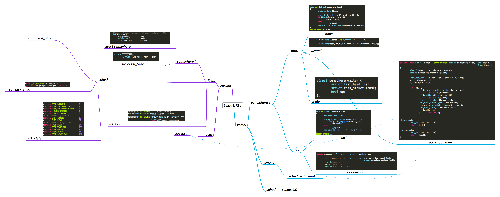
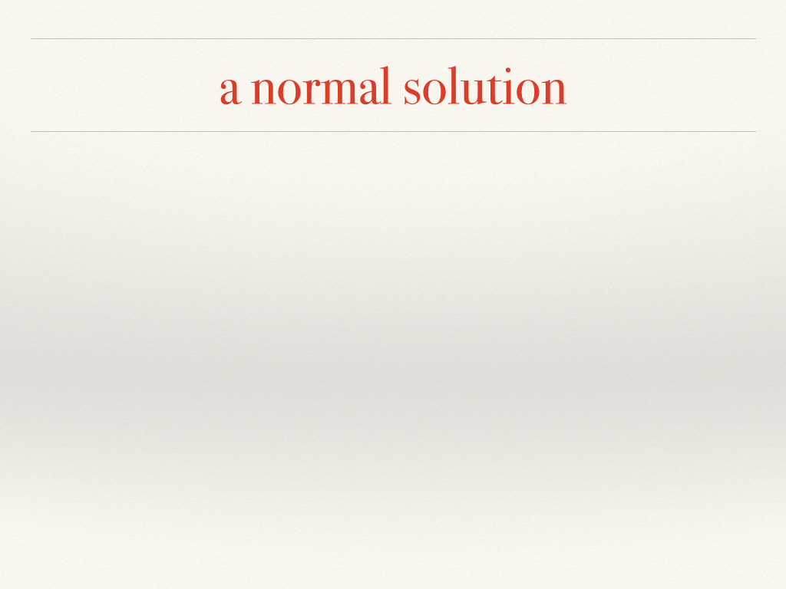

#Final project report by Shian Chen

- The Linux (3.12.1) Semaphore Implementation
- The jos Semaphore Implementation

## The Linux (3.12.1) P/V Implementation


Linux提供的用于支持信号量的系统调用如下
include/linux/syscalls.h:
```c
asmlinkage long sys_semget(key_t key, int nsems, int semflg);
asmlinkage long sys_semop(int semid, struct sembuf __user *sops,
				unsigned nsops);
asmlinkage long sys_semctl(int semid, int semnum, int cmd, unsigned long arg);
asmlinkage long sys_semtimedop(int semid, struct sembuf __user *sops,
				unsigned nsops,
				const struct timespec __user *timeout);
```

信号量结构
include/linux/semaphore.h:
```c
/* Please don't access any members of this structure directly */
struct semaphore {
	raw_spinlock_t		lock;	//用来保护semaphore的自旋锁
	unsigned int		count;	//信号量的初始值
	struct list_head	wait_list;	//等待队列
};
```

等待队列是一个双向链表
include/linux/types.h:
```c
struct list_head {
	struct list_head *next, *prev;	//只有next和prev指针
};
```

信号量初始化宏
include/linux/semaphore.h:
```c
#define __SEMAPHORE_INITIALIZER(name, n)				\
{									\
	.lock		= __RAW_SPIN_LOCK_UNLOCKED((name).lock),	\
	.count		= n,						\
	.wait_list	= LIST_HEAD_INIT((name).wait_list),		\
}
```

主要的操作由自旋锁`sem->lock`保护，按照PV的语义它可能会block，但是这个锁排斥了所有的进程，而且处于积极等待，所以势必在block的时候要释放这个锁，那释放之后呢，PV的语义如何保持？
kernel/semaphore.c:
```c
void down(struct semaphore *sem)
{
	unsigned long flags;

	raw_spin_lock_irqsave(&sem->lock, flags);
	if (likely(sem->count > 0))
		sem->count--;
	else
		__down(sem);	//信号量不够，进入等待队列
	raw_spin_unlock_irqrestore(&sem->lock, flags);
}
```
```c
void up(struct semaphore *sem)
{
	unsigned long flags;

	raw_spin_lock_irqsave(&sem->lock, flags);
	if (likely(list_empty(&sem->wait_list)))
		sem->count++;
	else
		__up(sem);	//从等待队列中释放
	raw_spin_unlock_irqrestore(&sem->lock, flags);
}
```


`__down_common`的实现如下。由于这是个inline函数，且参数`state`、`timeout`都是常量，所以他们会被编译器优化掉(optimized away)。

kernel/semaphore.c:
```c
struct semaphore_waiter {
	struct list_head list;	//等待队列，双向链表
	struct task_struct *task;	//这是Linux中进程的控制模块(PCB)数据结构
	bool up;	//此变量表示这个waiter是否醒了
};
static inline int __sched __down_common(struct semaphore *sem, long state,
								long timeout)
{
	struct task_struct *task = current;	//是否还记得jos中的curenv?
	struct semaphore_waiter waiter;

	list_add_tail(&waiter.list, &sem->wait_list);	
	waiter.task = task;
	waiter.up = false;

	for (;;) {
		if (signal_pending_state(state, task))	//被signal中断
			goto interrupted;
		if (unlikely(timeout <= 0))		//超时
			goto timed_out;
		__set_task_state(task, state);		//改变当前task的状态为休眠，进入消极等待
		raw_spin_unlock_irq(&sem->lock);	//释放锁
		timeout = schedule_timeout(timeout);	//调用CFS schedule，注意我们已经在内核态
		raw_spin_lock_irq(&sem->lock);
		if (waiter.up)				//P返回
			return 0;
	}

 timed_out:
	list_del(&waiter.list);
	return -ETIME;

 interrupted:
	list_del(&waiter.list);
	return -EINTR;
}
```
既然`__set_task_state(task, state)`改变了进程`task`的状态，那么Linux进程都有哪些状态？


关于进程状态：

 - TASK_RUNNING：进程当前正在运行，或者正在运行队列中等待调度。
 - TASK_INTERRUPTIBLE：进程处于睡眠状态，正在等待某些事件发生。进程可以被信号中断（正在睡眠的进程被中断是什么意思？）。接收到信号或被显式的唤醒呼叫唤醒之后，进程将转变为 TASK_RUNNING 状态。
 - TASK_UNINTERRUPTIBLE：此进程状态类似于 TASK_INTERRUPTIBLE，只是它不会处理信号。中断处于这种状态的进程是不合适的，因为它可能正在完成某些重要的任务。 当它所等待的事件发生时，进程将被显式的唤醒呼叫唤醒。
 - TASK_STOPPED：进程已中止执行，它没有运行，并且不能运行。接收到 SIGSTOP 和 SIGTSTP 等信号时，进程将进入这种状态。接收到 SIGCONT 信号之后，进程将再次变得可运行。
 - TASK_TRACED：正被调试程序等其他进程监控时，进程将进入这种状态。
 - EXIT_ZOMBIE：进程已终止，它正等待其父进程收集关于它的一些统计信息。
 - EXIT_DEAD：最终状态（正如其名）。将进程从系统中删除时，它将进入此状态，因为其父进程已经通过 wait4() 或 waitpid() 调用收集了所有统计信息。

将进程置为睡眠状态的普通方法是将进程状态设置为 TASK_INTERRUPTIBLE 或 TASK_UNINTERRUPTIBLE 并调用调度程序的 schedule() 函数。这样会将进程从 CPU 运行队列中移除。如果进程处于可中断模式的睡眠状态（通过将其状态设置为 TASK_INTERRUPTIBLE），那么可以通过显式的唤醒呼叫（wakeup_process()）或需要处理的信号来唤醒它。

`__up`是这么实现的：
```c
static noinline void __sched __up(struct semaphore *sem)
{
	struct semaphore_waiter *waiter = list_first_entry(&sem->wait_list,
				struct semaphore_waiter, list);	//FIFO！
	list_del(&waiter->list);
	waiter->up = true;
	wake_up_process(waiter->task);	//由操作系统来唤醒进程
}
```

所以P/V操作确实是通过改变进程状态来实现消极等待的。

花絮
---

发现远古生物Linus和某人吵架的记录，关于recursive/non-recursive lock：
```
From: Linus Torvalds <torvalds@linux-foundation.org>
Newsgroups: fa.linux.kernel
Subject: Re: [PATCH] netfilter: use per-CPU recursive lock {XV}
Date: Mon, 27 Apr 2009 19:59:40 UTC
Message-ID: <fa.cvsMfjwGlUaliv65eMH/WhjKQ8o@ifi.uio.no>

On Mon, 27 Apr 2009, Stephen Hemminger wrote:
>
> All those references support my argument that the lock is being
> used recursively in this case.

What's so hard between understanding the difference between "used
recursively" and "recursive lock"?

THEY MEAN TWO TOTALLY DIFFERENT THINGS!

The fact that you don't seem to understand that is one of the things I've
been complaining about all along.

...(此处省略10000字)

```

Linux nodes:


操统(编译)实习??:




参考文献：

[Linux kernel source code (linux-3.12.1)](https://www.kernel.org/)

[Linux manual](man7.org)

[http://www.ibm.com/developerworks/](http://www.ibm.com/developerworks/cn/linux/l-task-killable/)

[Linux kernel cross reference](http://lxr.free-electrons.com/source)

[http://stackoverflow.com/questions/187761/recursive-lock-mutex-vs-non-recursive-lock-mutex](http://stackoverflow.com/questions/187761/recursive-lock-mutex-vs-non-recursive-lock-mutex)


##The jos Implementation

由于前面部分已经说的很详细，这里就简略说下jos实现，首先定义数据结构（一些常量定义在`inc/csa.h`中）：
```c
struct Env_list {
	struct Env* e[MAX_P];
	int n;
};

struct semaphore {
	struct spinlock lock;	//用来保护semaphore的自旋锁
	unsigned int count;	//信号量的初始值
	struct Env_list wait_list;	//等待队列
} sem[MAX_S];
int sem_n;
```

增加系统调用`sys_pv`，用来实现N、P、V，N为请求一个semaphore。
直接利用jos kernel的spinlock来为对每个semaphore进行保护。
```c
int sys_pv(uint32_t a1, uint32_t a2) {
	if (a1 == CONST_NEW) {
		//返回 semaphore id
		spin_initlock(&sem[sem_n].lock);
		sem[sem_n].count = a2;
		memset(&sem[sem_n].wait_list, 0, sizeof(sem[sem_n].wait_list));
		sem_n++;
		return sem_n-1;
	} else {
		int id = a2;
		if (id < 0 || id >= MAX_S)
			return -1;
		if (a1 == CONST_P) down(sem+id);
		else if (a1 == CONST_V) up(sem+id);
	}
	return 0;
}
```
在`lib/syscall.c`中增加接口`sem_N`，`sem_P`，`sem_V`以方便调用：
```c
int 
sys_pv(int type, int va)
{
	return syscall(SYS_pv, 0, type, va, 0, 0, 0);
}

int sem_N(int n) {
	return sys_pv(CONST_NEW, n);
}
void sem_P(int id) {
	sys_pv(CONST_P, id);
}
void sem_V(int id) {
	sys_pv(CONST_V, id);
}
```
down的实现：
```c
void down(struct semaphore *s) {
	spin_lock(&s->lock);
	if (s->count > 0){
		s->count--;
		cprintf("down %d pass\n", s-sem);
	} else { //信号量不够，进入等待队列
		s->wait_list.e[s->wait_list.n] = curenv;
		curenv->env_status = ENV_NOT_RUNNABLE;
		s->wait_list.n++;
		cprintf("down %d block\n", s-sem);
		spin_unlock(&s->lock);
		sys_yield();
	}	 
	spin_unlock(&s->lock);
}
```
up的实现：
```c
void up(struct semaphore *s) {
	spin_lock(&s->lock);
	if (s->wait_list.n == 0) {	//wait_list is empty
		s->count++;
		cprintf("up %d pass\n", s-sem);
	} else { //从等待队列中释放
		s->wait_list.n--;
		s->wait_list.e[s->wait_list.n]->env_status = ENV_RUNNABLE;
		cprintf("up %d release\n", s-sem);
	}
	spin_unlock(&s->lock);
}
```

Tests
===

test 0
---
```c
void
umain(int argc, char **argv)
{
	int r;
	cprintf("i am parent environment %08x\n", thisenv->env_id);
	int sem = sem_N(1);
	sem_P(sem);
	cprintf("i am parent environment %08x\n", thisenv->env_id);
}
```
调用P之后应当顺利通过：
```
i am parent environment 00001001
down 0 pass
superblock is good
i am parent environment 00001001
envs[0].env_status: 4
envs[1].env_status: 0
No runnable environments in the system!
Welcome to the JOS kernel monitor!
```

test 1
---
```c
void
umain(int argc, char **argv)
{
	int r;
	cprintf("i am parent environment %08x\n", thisenv->env_id);
	int sem = sem_N(0);
	sem_P(sem);
	cprintf("i am parent environment %08x\n", thisenv->env_id);
}
```
调用P之后应当Block：
```
i am parent environment 00001001
down 0 block
superblock is good
envs[0].env_status: 4
envs[1].env_status: 4
No runnable environments in the system!
Welcome to the JOS kernel monitor! 
```

test 2
---
由于我们使用的是round robin调度，为了模拟随机情况，我们使用如下方式测试：
情况1:
```c
void
umain(int argc, char **argv)
{
	int id;
	cprintf("i am parent environment %08x\n", thisenv->env_id);
	int sem = sem_N(0);
	if ((id = fork()) == 0) {
		//child
		sem_P(sem);
	} else {
		//father
		sem_V(sem);
	}
	cprintf("i am parent environment %08x\n", thisenv->env_id);
}
```
```
i am parent environment 00001001
superblock is good
up 0 pass
i am parent environment 00001001
down 0 pass
i am parent environment 00001002
envs[0].env_status: 4
envs[1].env_status: 0
No runnable environments in the system!
Welcome to the JOS kernel monitor!
```
情况2:
```c
void
umain(int argc, char **argv)
{
	int id;
	cprintf("i am parent environment %08x\n", thisenv->env_id);
	int sem = sem_N(0);
	if ((id = fork()) == 0) {
		//child
		sem_V(sem);
	} else {
		//father
		sem_P(sem);
	}
	cprintf("i am parent environment %08x\n", thisenv->env_id);
}
```
```
i am parent environment 00001001
superblock is good
down 0 block
up 0 release
i am parent environment 00001002
i am parent environment 00001001
envs[0].env_status: 4
envs[1].env_status: 0
No runnable environments in the system!
```

test 3, producer-consumer
---
```c
void
umain(int argc, char **argv)
{
	int n = 10;
	int head = 0;
	int tail = 0;

	int empty = sem_N(3);
	int full = sem_N(0);

	if (fork() != 0) {
		int i;
		for (i = 0; i < n; ++i) {
			sem_P(full);
			cprintf("consuming %d\n", head);
			head++;
			sem_V(empty);
		}
	} else {
		int i;
		for (i = 0; i < n; ++i) {
			sem_P(empty);
			cprintf("producing %d\n", tail);
			tail++;
			sem_V(full);
		}
	}
}
```
as expected:
```
down 1 block
down 0 pass
producing 0
up 1 release
down 0 pass
producing 1
up 1 pass
down 0 pass
producing 2
up 1 pass
down 0 block
consuming 0
up 0 release
down 1 pass
producing 3
up 1 pass
down 0 block
consuming 1
up 0 release
down 1 pass
consuming 2
up 0 pass
down 1 pass
consuming 3
up 0 pass
down 1 block
producing 4
up 1 release
down 0 pass
producing 5
up 1 pass
down 0 pass
producing 6
up 1 pass
down 0 block
consuming 4
up 0 release
down 1 pass
consuming 5
up 0 pass
producing 7
up 1 pass
down 0 pass
producing 8
up 1 pass
down 0 block
down 1 pass
consuming 6
up 0 release
down 1 pass
consuming 7
up 0 pass
down 1 pass
consuming 8
up 0 pass
down 1 block
producing 9
up 1 release
consuming 9
up 0 pass
envs[0].env_status: 4
envs[1].env_status: 0
No runnable environments in the system!
Welcome to the JOS kernel monitor!
```


